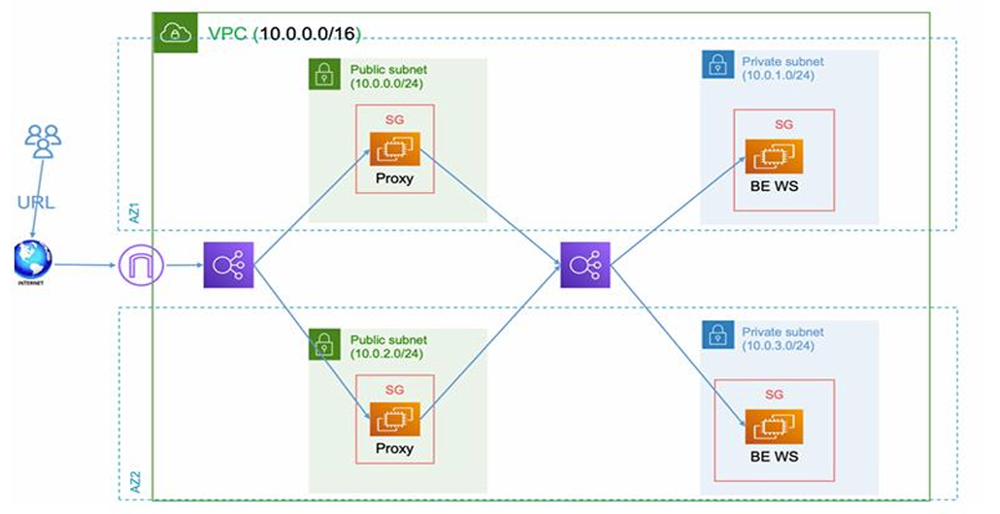
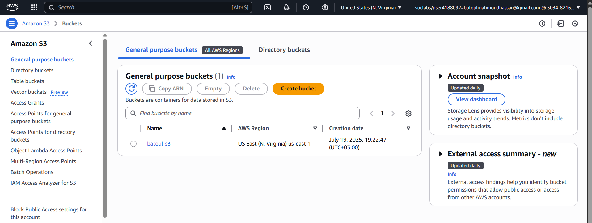
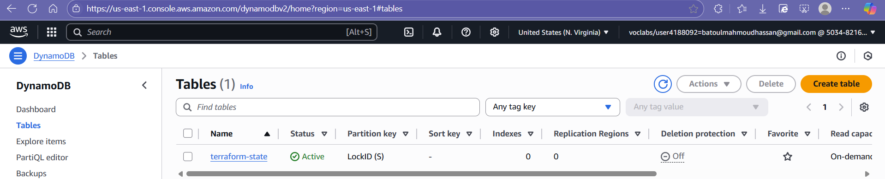
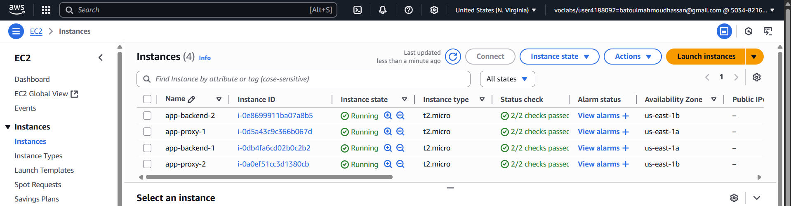
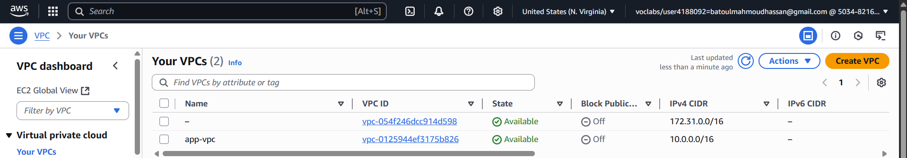
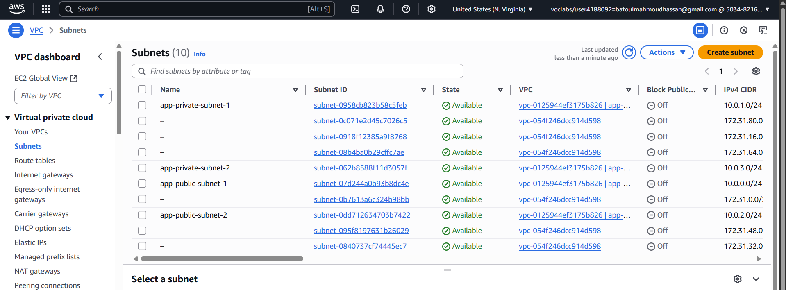
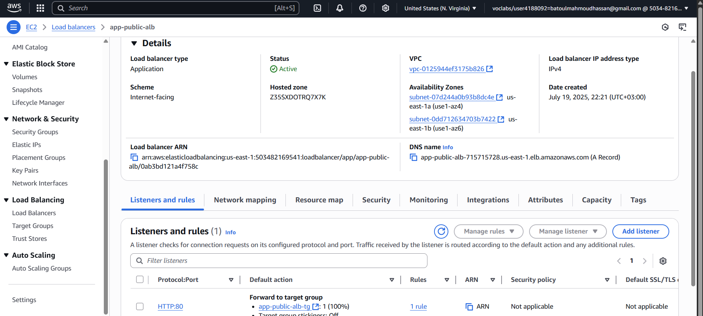
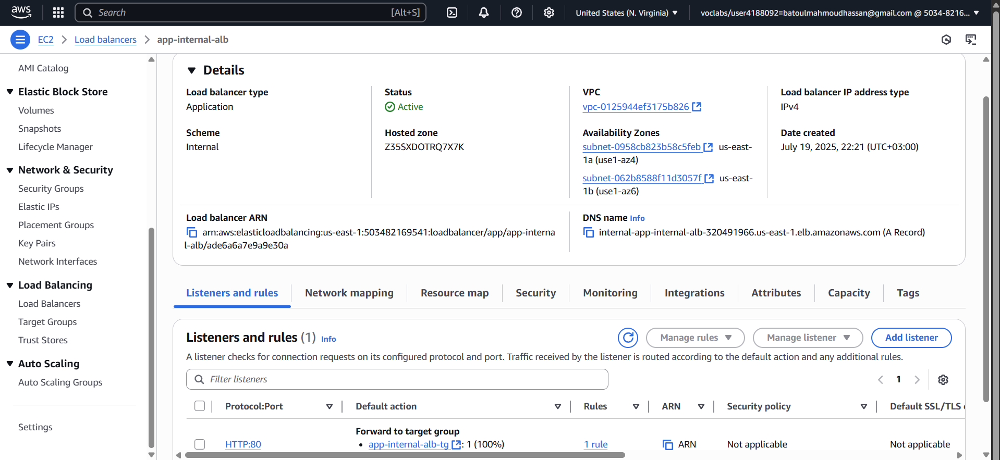

#  Terraform Project
## 🚀 Project Overview

This project provisions a highly available, multi-tier AWS infrastructure using Terraform.
---
### 🧱 Architecture Summary:
- **VPC** with public and private subnets spread across two availability zones.
- **Public Subnets** host **proxy servers**  to route traffic.
- **Private Subnets** host **backend web servers** for handling application logic.
- **Security Groups** control traffic between layers to enforce strict access rules.
- An **Application Load Balancer (ALB)** distributes external traffic across proxies.
- The setup ensures **high availability**, **scalability**, and **network isolation**.
## Infrastructure Overview

---

## 🛠️ How It Works

### 1.  Amazon S3 Storage 
**Purpose**: Stores Terraform state files securely with versioning enabled  
**Key Features**:
- Located in `us-east-1` (N. Virginia)
- IAM Access Analyzer enabled for security auditing
- Storage Lens metrics configured for cost monitoring

---
## 2.  DynamoDB State

**Purpose**: Prevents concurrent Terraform executions that could corrupt state  
**Configuration**:
- On-demand capacity mode

---

## 3. EC2 Instances

### Proxy Instances :  'app-proxy-1`, `app-proxy-2` 
-**Deployed in public subnets.**

### Backend Instances: 'app-backend-1`, `app-backend-2`  
- **Deployed in private subnets.**
  

---
## 4. VPC

-**provides network isolation.**

---
## 5. Subnets

-**Public and private subnets for proxy and backend instances.**

---
## 6. Load Balancer

-**Public & Internal load balancers to distribute traffic to proxy and backend instances.**

---

# 📋 Deployment Guide

## 🛠️ Prerequisites
- Terraform v1.0+ installed
- AWS configured with credentials
  
## 🔑 Step-by-Step Deployment

### 🌱 1. Initialize Terraform
-**terraform init**

### 💻 2. Configure Variables
-**variables.tf - Update AMI IDs, instance types, etc.**
-**terraform.tfvars - Set your specific values**

### 💡3. Apply Infrastructure
-**terraform apply**

### 🔍 4. Access Deployment Outputs
-**find output through terraform output**

### ☠️ 5. Destroy Infrastructure (When Complete)
-**terraform destroy**

